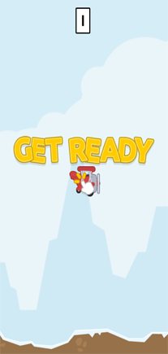
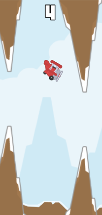
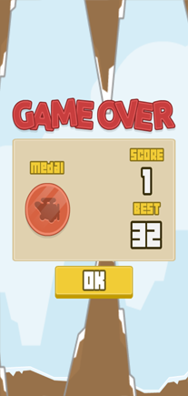

# ✈️ Porco Rosso Bird

   

**Porco Rosso Bird** is a whimsical Flappy Bird–style arcade game inspired by Studio Ghibli’s *Porco Rosso*. Take control of a brave red floatplane as you navigate through perilous mountain peaks. How far can you fly before crashing into the rugged alpine terrain?

> 🎮 **Built with Godot Engine 4.6.2**

---

## 🎮 Gameplay

- **Flap** – tap, click, or press a key to make the plane gain altitude.
- **Avoid obstacles** – dodge the oncoming mountain pairs.
- **Score points** – each successfully passed gap gives you one point.

Crash into a mountain, the ground, or the sky ceiling, and it's game over. Try to beat your own high score!

---

## ✨ Features

- Hand‑crafted Ghibli‑inspired art  
- Smooth physics and responsive controls   
- Persistent high score (saved locally)  
- Retro sound effects  
- Optimised for both desktop and mobile  
- Made entirely with **Godot Engine 4.6.2**

---

## 🕹️ How to Play

| Action               | Input                                      |
|----------------------|--------------------------------------------|
| Flap (lift the plane)| Mouse click / Touch tap / Space / Up arrow |
| Restart after game over | Same as flap (any of the above)         |

The goal is simple: **survive as long as possible** and set a new high score.

---

## 📦 Installation & Running

You can play the game in two ways:

### 1. Play the exported version (no Godot required)
- Download the latest release from the [Releases page](https://github.com/your-username/porco-rosso-bird/releases)
- Unzip and run the `.exe` (Windows), `.app` (macOS), or `.x86_64` (Linux)

### 2. Run from source with Godot Engine
1. **Clone the repository**  
   ```bash
   git clone https://github.com/your-username/porco-rosso-bird.git
   cd porco-rosso-bird
